# DYB - a tool for tracking sample dry-downs

A screenshot of the app in action. Overview of functionality and installation details below.

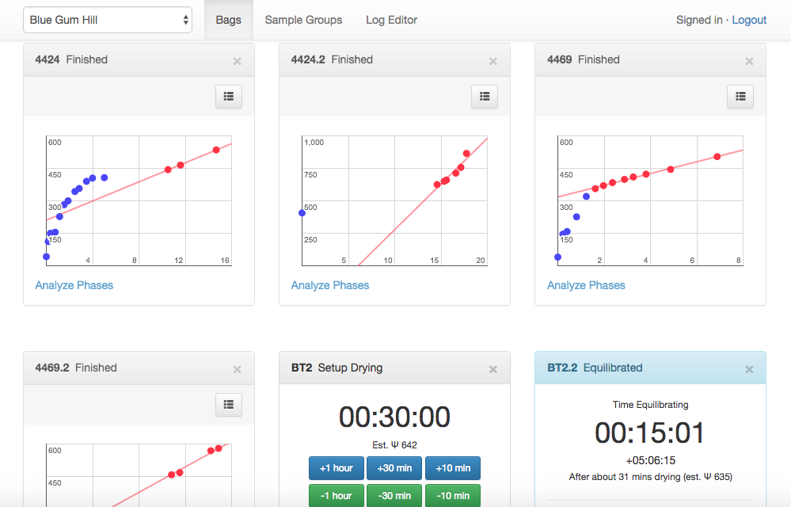

## Overview

This app allows you manage sample dry-downs for plant drought experiments, typically for measurement of hydraulic conductance to generate vulnerability curves.

The general procedure for using the app is as follows:

1. Individual samples (typically a branch) are sealed in separate bags and each bag is marked with a unique ID.

2. The app is loaded in a browser and once logged in the user creates a new 'sample group' with an appropriate name for the group (e.g. a combination of sampling location and date).

    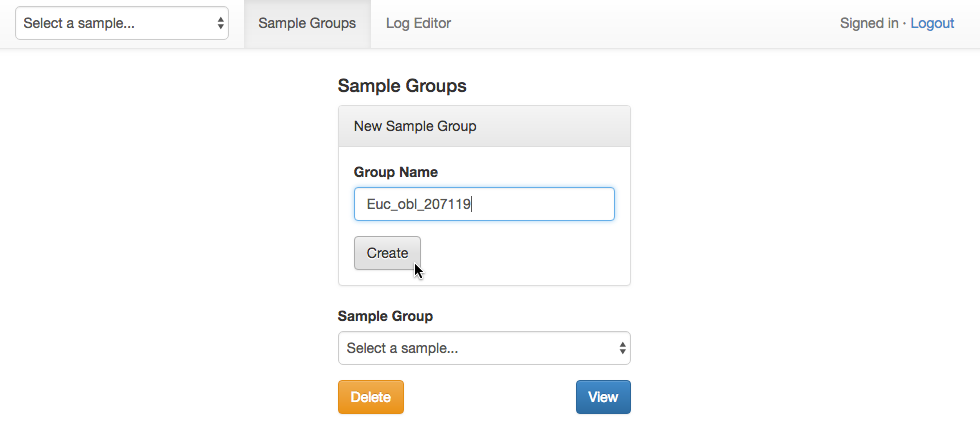

3. In turn, each branch is removed from its sealed bag and the water potential is measured using a pressure chamber and the branch is placed on top of the bag to start drying. In the app a new 'bag' is created and the initial water potential is entered. The user then selects how long the sample should be dried for and a drying timer starts running. The drying time can be extended or reduced while the drying timer is running.

    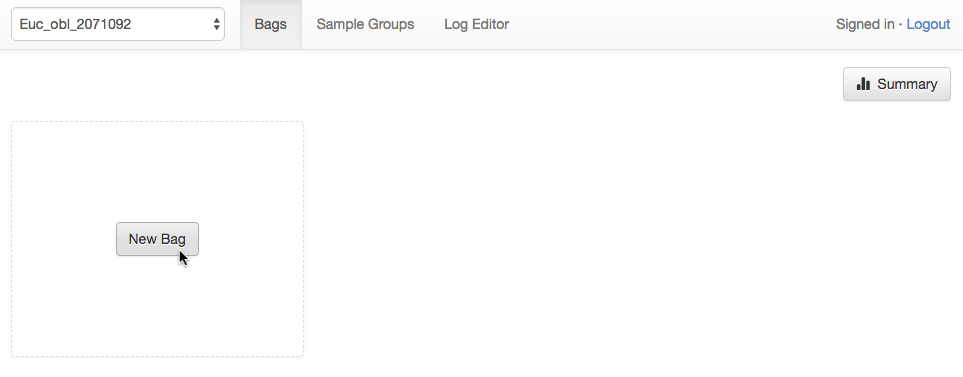
    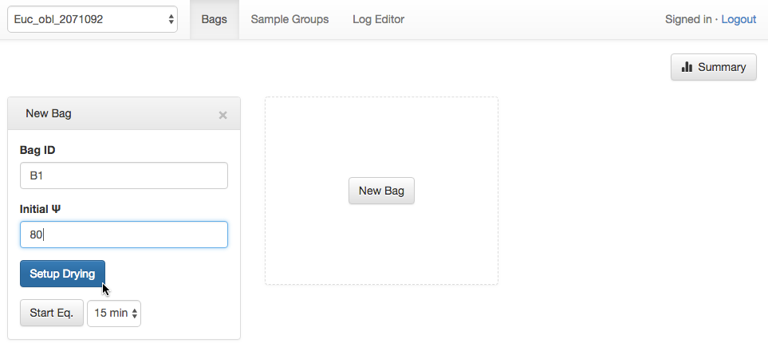
    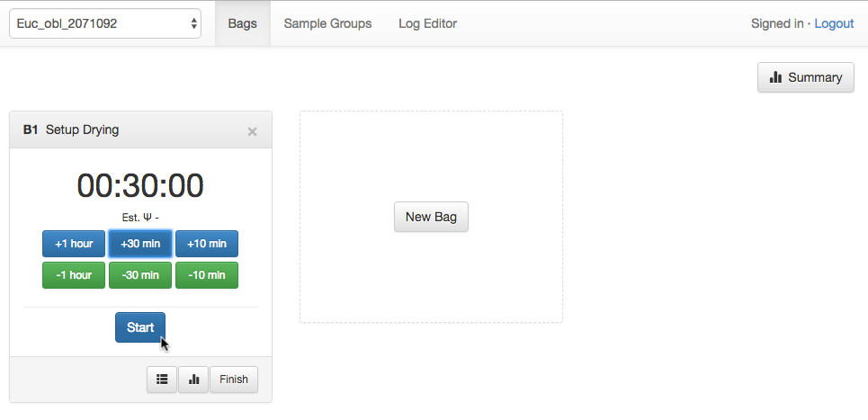
    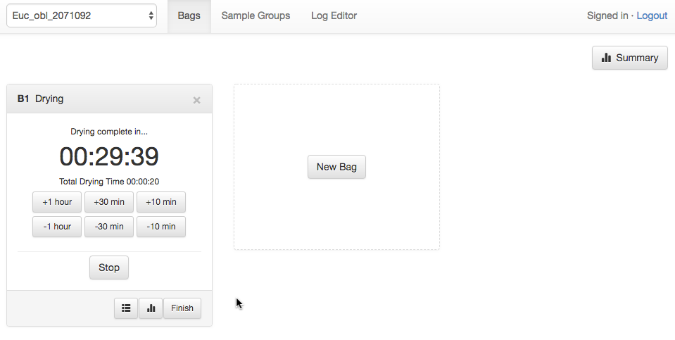

4. Once the drying time has elapsed the timer will sound an alarm. The sample is now returned to the bag and sealed for equilibration. In the app the user selects a time for equilibration e.g. 15 mins and an equilibration timer starts running.  

    Drying completed | Equilibrating
    --- | ---
    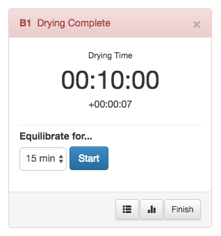 | 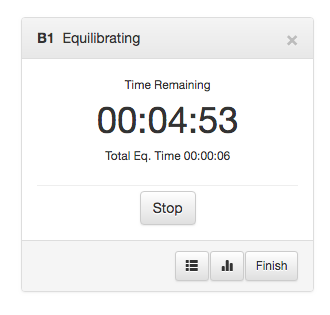 

5. Once the equilibration time has elapsed another alarm will sound. A section of the sample is now removed from the sample in the bag and the water potential is determined (having re-sealed the bag). The water potential for the sample is entered into the program.

    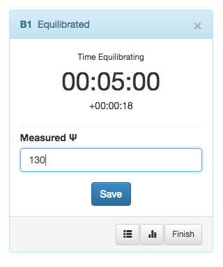

6. If the target water potential has been achieved then the sample (typically just a section of the sample e.g. a leaf or stem or leaf and stem shoot) can now be measured for conductance. If the target water potential has not been achieved then the sample can be removed from the bag and a new drying time can be selected and the process repeats from step 4.

7. If the app has data for 2 drying times and water potentials then the app will apply a linear regression model to estimate water potential based on current drying times. By clicking the list and graph icons you can see the data entered and a plot of drying time/water potential and the regression applied. By monitoring the change in the standard error of the regression the app attempts to identify different phases in drying and uses the most recent regression to estimate drying times and water potentials.  

    Data | Plot | Estimated WP shown (C = Current WP, F = Final WP)
    --- | --- | --
    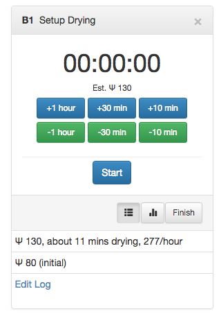 | 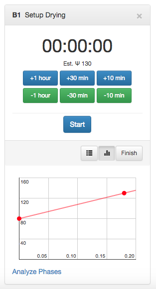 | 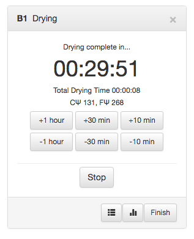

### Notes

* Drying can be stopped at any time using the 'Stop' button. The bag can then be setup for equilibration. Equilibration can also be stopped before the timer is complete.

* Water potentials and drying times can be edited for any bags by using the Log Editor which can be accessed from the bag data list (when viewing the data for the bag via the list icon) or from the top menu.

    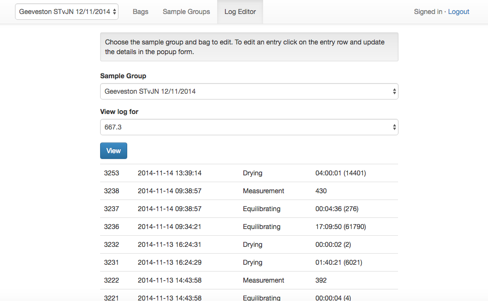

* Click the 'Summary' button to see an overview of where each bag is at in terms of drying and estimated water potential.

    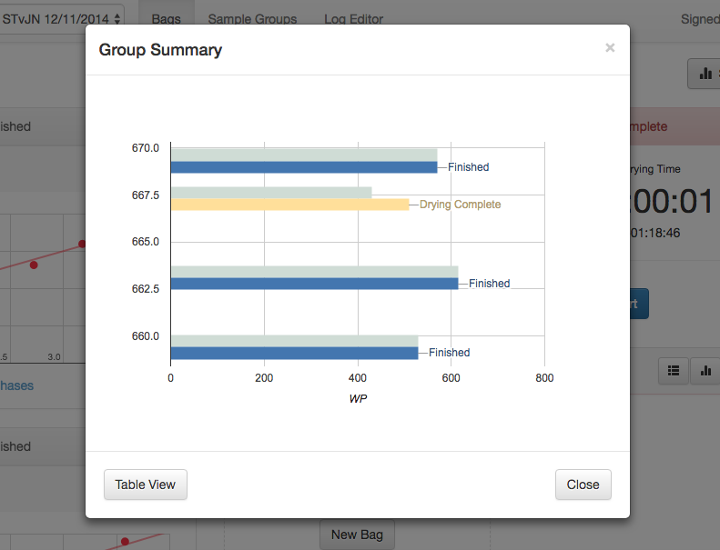

* The system supports multiple users but these must be added to the database directly.

* The 'Analyze phases' button links to a website that isn't currently available.

## Installation

The app was built using WordPress (http://www.wordpress.org) 3.8 and a custom theme and plugin. Using WordPress as an app framework isn't ideal because WordPress is a content management system with way more functionality than is needed for a relatively simple app that has absolutely no content at all.  But at the time I had just finished developing a wordpress plugin/framework that makes wordpress theme development faster so it seemed smart idea to develop the app using the plugin so that 1) the new plugin could be tested, and 2) the app could be developed faster as a result of using the plugin. With hindsight this wasn't the greatest idea because the app is now married to WordPress and the overall system is much more complex and bloated than it needs to be. Really it should be ported over to something like node.js, even rails, or a php framework like laravel. 

So the guts of the app itself is provided by a custom theme and a custom plugin which can be found in the files here:

* wp-content/themes/dry-master (and the guts of the guts is in the 'class' sub-directory)
* wp-content/plugins/emu-framework (doesn't have anything specific to the app)

... and theoretically it should be possible to take only these two folders and drop them into the themes and plugin folders of a new wordpress installation, but given the latest wordpress is now quite a few versions ahead of the wordpress that was used when this app was initially developed I suspect that probably won't work. So to ensure compatibility I have included the app AND wordpress 3.8 in this repository and as long as you stick with that it should be fine.

To install/run WordPress you need to setup a webserver that can run PHP programming code. Plus you'll need a MySQL database server for the database. Installing and configuring a setup like this is beyond the scope of this README. I could go through all the necessary steps but there are endless ways the installation might not work at certain stages because of some random eccentricity of your environment, like firewall settings for your network or computer, or the difference between the mac and windows environment. So really the best way to get this up and running is to get someone with php/mysql/apache experience to set it up. Given the contents of this repo they will know immediately what to do with these files.

Failing that you could use a pre-configured "1-click install" development environment that includes everything you need already configured. [MAMP](https://www.mamp.info/) would be a good starting point but there are [others around](https://premium.wpmudev.org/blog/testing-environment-wordpress/). If all else fails you can contact me directly - christopher.lucani[at]utas.edu.au.

